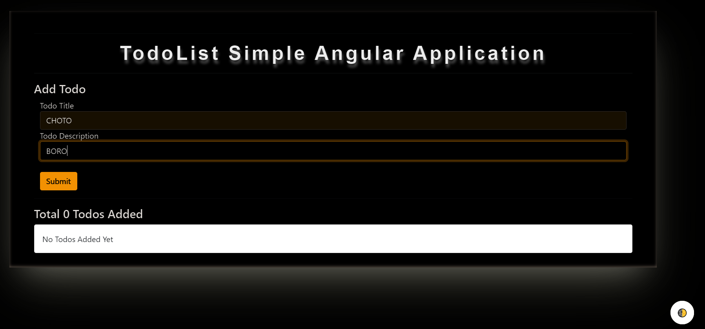

# TODOLIST-ANGULAR_APPLICATION :star_struck: :memo: 
:pencil: :book: :file_folder: :clipboard: :iphone: :computer:

[](https://shields.io/) [](https://shields.io/) [](https://shields.io/) [](https://shields.io/) [](https://shields.io/) [](https://shields.io/) [](https://shields.io/) [](https://shields.io/)

***This new Web Application named 'TODOLIST-ANGULAR' is created by Biswarup Bhattacharjee, student of BTECH, in University of Engineering and Management, Kolkata.***

**Email Id: bbiswa471@gmail.com.** 

**Contact No: 916290272740.** 

[](https://www.facebook.com/biswarup.bhattacharjee.5811) [](https://github.com/biswa2210)

## About :point_down: 

<div align="justified">
  
**It is a web application which can be used as [todo-list](https://en.wikipedia.org/wiki/Wikipedia:To-do_list). The name of this web app is 'todolist-Angular'.** This web app is totally responsive. It can be used efficiently in laptop, desktop, android, iphone, or any tab etc. **One special thing is the dark mode or night mode facility.** If we turn off pc by leaving it in dark mode when we will again turn on it it will be in dark mode that time also. This theme is specially for those developers, students, teachers, office workers who work in day time as well as at night. Here we can title and detail for each work we want to finish in future. Here in the list we can see the exact date and time of the issue of that task. It helps us to do our our on time. Once we finish the job we can mark it as finish. And a line like pen through in notes will cut the work. We can also delete the job when we want. For each device their will be different todolist records(as per user). The data in todolist web app will be stored in that device's local storage. It is very easy to use this web app. Anyone can keep their personal tasks' list so that he or she will be able to finish that job in perfect time.       
</div>

## Some points about data user put in this app :point_down:
 - [x] 'Safe'<br>
 - [x] 'No-one can access'<br>
 - [x] 'Personalized Data in Local Storage of device'<br>

 <details>
       <summary>"Click here to read what to add for each task'</summary>
 - Title<br>
 - Detail<br>

</details>


## Theme of this web app :point_down:
 - [x] 'Light mode/Day mode'<br>
 - [x] 'Dark mode/Light mode'<br>
 
## LINK : :point_right: https://todolist-by-biswa.netlify.app/

## Purpose :point_down:

<div align="justified">

I have made this web app for students, teachers, office workers, businessmen, developers, actually everyone. Anyone can use it for keepping their tasks enlisted. So that they can do their job on time.

</div>

## Use :point_down:

<div align="justified">

Here user just has to open the particular link of this web app and add task by giving title and detail. User can apply dark mode or light mode according to his or her need. User can mark a job as finished when it's done. User can also delete any task.

</div>      
       
## Importance :point_down:

<div align="justified">
  
For keeping 'todolist' this web app is user friendy, easy to use, efficient and safe. Let's discuss about importance of todolists. These are prioritized lists of all the tasks that you need to carry out. They list everything that you have to do, with the most important tasks at the top of the list, and the least important tasks at the bottom. By keeping such a list, you make sure that your tasks are written down all in one place so you don't forget anything important. And by prioritizing tasks, you plan the order in which you'll do them, so that you can tell what needs your immediate attention, and what you can leave until later. To-Do Lists are essential if you're going to beat work overload. When you don't use them effectively, you'll appear unfocused and unreliable to the people around you. When you do use them effectively, you'll be much better organized, and you'll be much more reliable. You'll experience less stress, safe in the knowledge that you haven't forgotten anything important. More than this, if you prioritize intelligently, you'll focus your time and energy on high-value activities, which will mean that you're more productive, and more valuable to your team. Keeping a properly structured and thought-out list sounds simple enough. But it can be surprising how many people fail to use them at all, never mind use them effectively. In fact, it's often when people start to use them effectively and sensibly that they make their first personal productivity breakthroughs, and start making a success of their careers. The video, below, gives some tips on how you can start to use To-Do Lists more effectively.
</div>

## Folder Structure :point_down:
```bash
todolist-Angular
       ├── src
       |     ├── app
       |     |     ├── My Components
       |     |     |           ├── add-todo
       |     |     |           |      ├── add-todo.component.css
       |     |     |           |      ├── add-todo.component.html
       |     |     |           |      ├── add-todo.component.spec.ts
       |     |     |           |      └── add-todo.component.ts
       |     |     |           ├── todo-item
       |     |     |           |      ├── todo-item.component.css
       |     |     |           |      ├── todo-item.component.html
       |     |     |           |      ├── todo-item.component.spec.ts
       |     |     |           |      └── todo-item.component.ts
       |     |     |           └── todos
       |     |     |                  ├── todos.component.css
       |     |     |                  ├── todos.component.html
       |     |     |                  ├── todos.component.spec.ts
       |     |     |                  └── todos.component.ts
       |     |     ├── app-routing.module.ts
       |     |     ├── app.component.css
       |     |     ├── app.component.html      
       |     |     ├── app.component.spec.ts
       |     |     ├── app.component.ts 
       |     |     └── app.module.ts
       |     ├── assets
       |     |     └── .gitkeep
       |     ├── environments
       |     |     ├── environment.prod.ts
       |     |     └── environment.ts
       |     ├── Todo.ts
       |     ├── favicon.ico   
       |     ├── index.html       
       |     ├── main.ts      
       |     ├── polyfills.ts     
       |     ├── style.css
       |     └── test.ts
       ├── e2e
       |     ├── src
       |     |     ├── app.e2e-spec.ts
       |     |     └── app.po.ts
       |     └── protractor.conf.js
       └── Karma.conf.js
```

## Making :point_down:

<div align="justified">
  
This project was generated with [Angular CLI](https://angular.io/cli) version 11.2.12. I have used TypeScript, Javascript, html, bootstrap and css. After creating this app we have source folder I had made My Components using ng generate command. Here I have created total 3 components add todo component, todo item component and todos component. Here all todos are stored in local storage of each device.

</div>

## Development server

Run `ng serve` for a dev server. Navigate to `http://localhost:4200/`. The app will automatically reload if you change any of the source files.

## Code scaffolding

Run `ng generate component component-name` to generate a new component. You can also use `ng generate directive|pipe|service|class|guard|interface|enum|module`.

## Build

Run `ng build` to build the project. The build artifacts will be stored in the `dist/` directory. Use the `--prod` flag for a production build.

## Running unit tests

Run `ng test` to execute the unit tests via [Karma](https://karma-runner.github.io).

## Running end-to-end tests

Run `ng e2e` to execute the end-to-end tests via [Protractor](http://www.protractortest.org/).

## Further help

To get more help on the Angular CLI use `ng help` or go check out the [Angular CLI Overview and Command Reference](https://angular.io/cli) page.


## Screenshots :point_down: 

<div align="center">
  
<a href="pics/todo9.jpeg"></a> <a href="pics/todo10.jpeg"></a> <a href="pics/todo11.jpeg"></a>
 
<a href="pics/todo12.jpeg"></a> <a href="pics/todo13.jpeg"></a> <a href="pics/todo14.jpeg"></a>

<a href="pics/todo1.PNG"></a> <a href="pics/todo2.PNG"></a>
 
<a href="pics/todo3.PNG"></a> <a href="pics/todo4.PNG"></a>

<a href="pics/todo5.PNG"></a> <a href="pics/todo6.PNG"></a>
</div>


